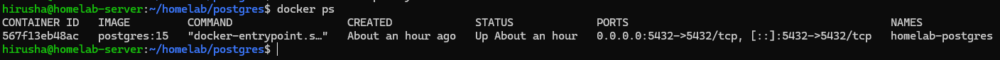
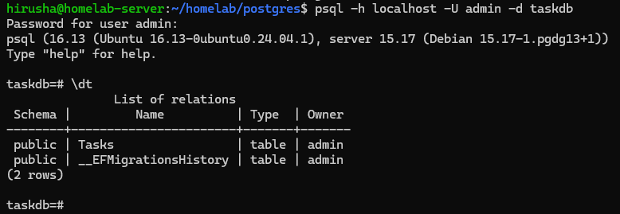
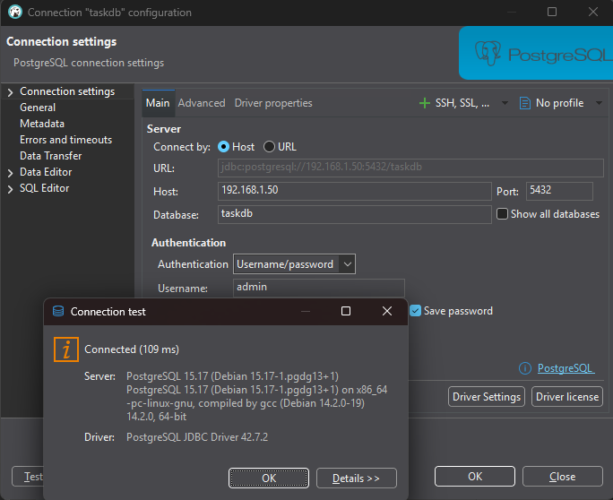
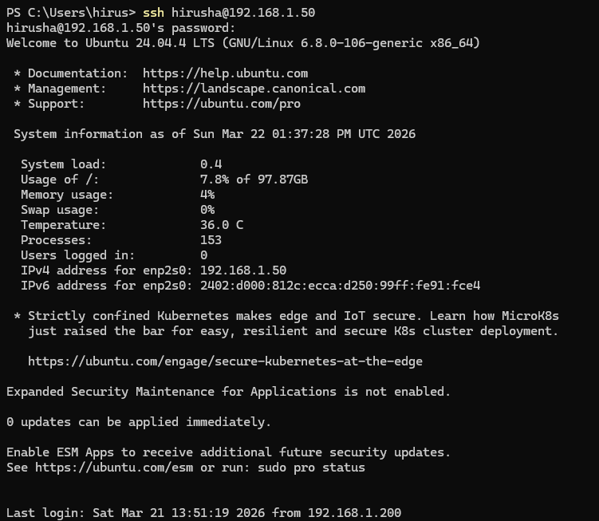

# 🏠 Homelab Infrastructure

This repository documents my personal developer homelab used to learn backend engineering, DevOps, and infrastructure.

The goal is to simulate a small production-like environment using Docker containers running on an Ubuntu server.

---

## 🎯 Infrastructure Goals

- Learn Linux server administration
- Deploy backend services using Docker
- Practice infrastructure monitoring
- Host databases and caching services
- Run local AI models for experimentation

---

## 🧱 Current Architecture (Phase 1–2)

- Ubuntu Server (Local Machine)
- Docker Engine & Docker Compose
- PostgreSQL (Docker container)
- Remote access via SSH
- Database accessible from local network

---

## 🗺️ Planned Infrastructure

- PostgreSQL ✅
- Redis (Next)
- MinIO (Object Storage)
- Nginx Reverse Proxy
- Prometheus (Monitoring)
- Grafana (Dashboards)
- Local AI (Ollama)

---

## 🛣️ Project Roadmap

- Phase 1 — Server foundation ✅
- Phase 2 — Database infrastructure 🔄
- Phase 3 — Backend deployment environment
- Phase 4 — Monitoring stack
- Phase 5 — Storage services
- Phase 6 — Local AI infrastructure

---

## 📊 Current Progress

### ✅ Completed
- Ubuntu Server installed
- Static IP configured (`192.168.1.50`)
- SSH remote access working
- Docker & Docker Compose installed
- PostgreSQL deployed via Docker
- Remote database access verified
- Backend connected to PostgreSQL

### 🔄 In Progress
- Redis setup
- API containerization

---

## 📁 Repository Structure

- architecture/ → System design and diagrams
- configs/ → Environment variables and configs
- docs/ → Setup and technical documentation
- infrastructure/ → Docker compose stacks
- scripts/ → Automation scripts
- screenshots/ → Proof of working system
---

## 📸 Screenshots

### 🐳 Docker Containers Running

### 🧪 PostgreSQL (psql)

### 🌍 Remote Database Connection

### 🔐 SSH Access

---

## 🧠 Key Learnings

- Docker-based service deployment
- Linux server management via SSH
- Networking (static IP, LAN access)
- Database hosting and remote connectivity
- Debugging real-world configuration issues

---

## 🚀 Next Steps

- Deploy Redis container
- Containerize backend API
- Set up Nginx reverse proxy
- Introduce monitoring (Prometheus + Grafana)

---

## 📌 Status

🚧 Phase 2 in progress — expanding infrastructure